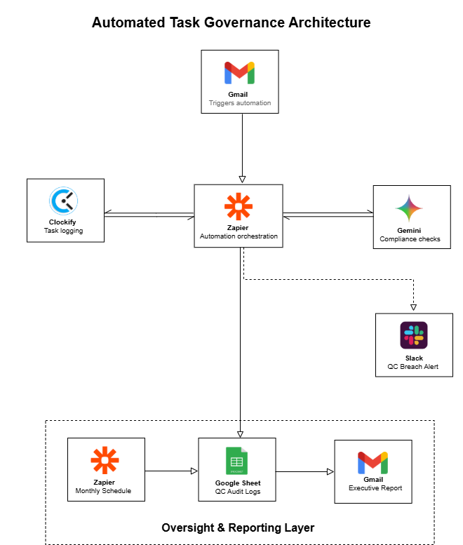

# Integrated Productivity Framework  
### LLM-Governed SaaS Automation (Portfolio Project)

The **Integrated Productivity Framework** is a reference implementation that demonstrates how modern SaaS automation can be governed using **Large Language Models (LLMs)** without sacrificing reliability, auditability, or operational control.

It transforms unstructured task requests into **structured, time-tracked, and policy-validated work items** by combining iPaaS automation with deterministic, JSON-based AI quality controls. The result is a system that reduces operational friction, surfaces risk early, and provides clear executive visibility into productivity and compliance.

---

## Why This Matters

Teams automate faster than they govern.

While SaaS tools improve speed and efficiency, they often introduce hidden risks:
- Silent automation failures
- Inconsistent outputs
- Embedded policy violations
- Limited audit trails

This framework introduces **LLM-driven governance as a control layer**, ensuring automation remains:
- **Consistent** – standardized, deterministic outputs  
- **Observable** – auditable execution and reporting  
- **Accountable** – traceable decisions and ownership  
- **Scalable** – governance grows with automation volume  

---

## Tech Stack

- **Zapier** — iPaaS automation & orchestration  
- **Gemini LLM** — AI-driven quality control & policy checks  
- **Clockify** — Work telemetry & time tracking  
- **Slack** — Real-time incident alerts  
- **Google Sheets** — Audit log, telemetry store, and reporting  

---

## System Design & Data Orchestration

  

This architecture shows an end-to-end automation pipeline where task ingestion is governed by an **LLM-based quality and policy layer**, with branching automation paths, full auditability, and executive reporting.

---

## Core Use Cases

- IT service management automation  
- Compliance-sensitive workflows  
- AI-assisted quality control pipelines  
- Cross-team operational reporting  
- Executive visibility into automated operations  

---

## Key Design Decisions

**Decoupled Architecture**  
Task ingestion and execution are isolated from AI governance, ensuring continuity even if the LLM is unavailable.

**Deterministic AI Governance**  
Gemini operates in JSON Mode with schema enforcement, making AI decisions safe for automation pipelines.

**Incident-Driven Operations**  
Policy breaches trigger immediate Slack alerts, reducing Mean Time to Recovery (MTTR).

**Telemetry & ROI Tracking**  
Monthly reporting quantifies time saved and efficiency gains, translating automation into measurable business value.

---

## Technical Challenges Solved

**LLM Non-Determinism**  
Solved using strict JSON schema enforcement and low-temperature inference to guarantee parseable outputs.

**Data Fragmentation Across SaaS Tools**  
Resolved by centralizing execution logs, AI audit results, and reporting metrics into a unified telemetry layer.

---

## What This Project Represents

**This is:**  
- A reference architecture  
- A governance-first automation model  
- A practical demonstration of systems thinking  

**This is not:**  
- A single-tool tutorial  
- A low-code shortcut  
- A replacement for human accountability  

---

## Outcomes

- Reduced operational risk  
- Faster detection of automation issues  
- Clear audit and compliance visibility  
- Improved trust in automated decisions  
- Easier onboarding and handover of workflows  
